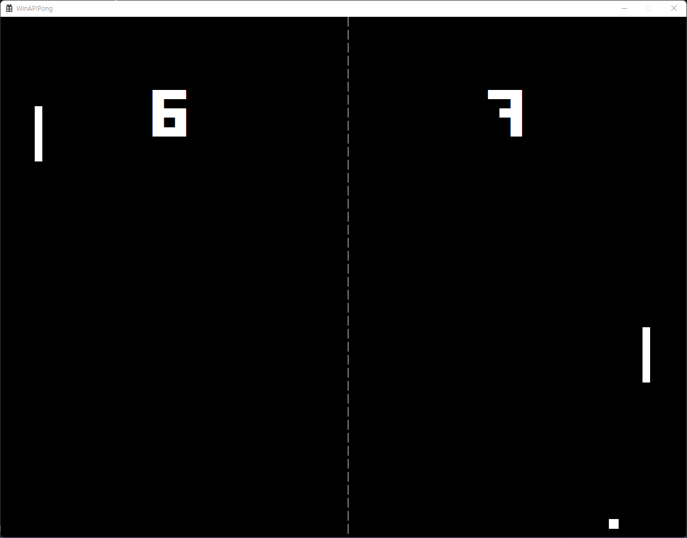

__Pong__
===

A beginner's first project that remake of the __Pong__ of Atari(1972) with Win32 API.  

__Demo__

__How to play__

Action |     Keys    
------ | -----------
 1P    |     A, Z   
 2P    |    Up, Down      
Exit   |     ESC

 __NOTE__: Before you play, you need to intstall:
  * [Forced Square Font](https://www.dafont.com/forced-square.font)
