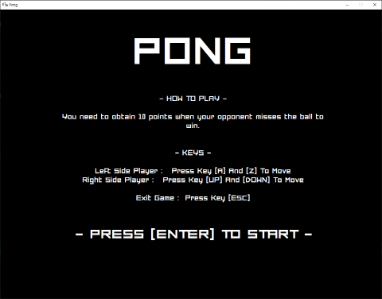

__Pong__
===

 __NOTE__
 
Before you play, you need to install [Microsoft Visual C++ Redistributable packages](https://learn.microsoft.com/en-us/cpp/windows/latest-supported-vc-redist?view=msvc-170)  

__Intro__

A beginner's first project that remake of the __Pong__ of Atari(1972) with Win32 API.  

__Main Screen__

__Demo Gameplay__

__Keys__

Action |     Keys    
------ | -----------
 1P    |     A, Z   
 2P    |    Up, Down      
Exit   |     ESC

__This game requires following:__

 
  * [Forced Square Font](https://www.dafont.com/forced-square.font)
  * [Microsoft Visual C++ Redistributable packages](https://learn.microsoft.com/en-us/cpp/windows/latest-supported-vc-redist?view=msvc-170)
